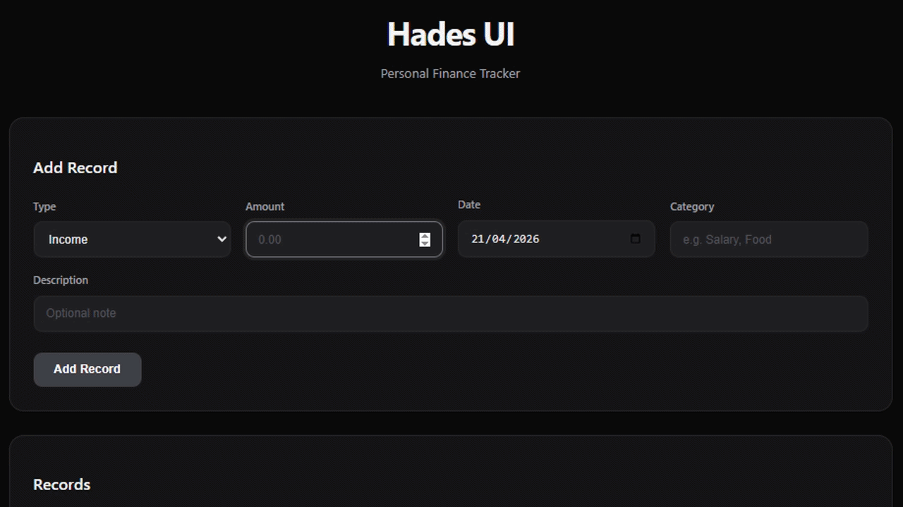
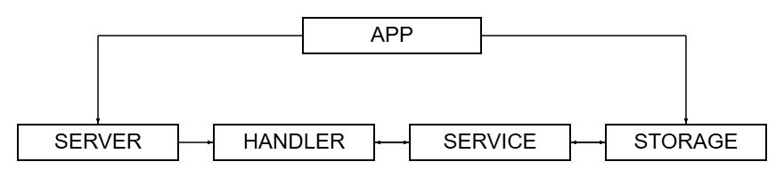

<h3 align="center">Financial transaction service with advanced analytics, grouping, filtering, sorting and CSV export.</h3>

## 



<br>

## Table of Contents

- [Architecture](#architecture)
- [Installation](#installation)
- [Configuration](#configuration)
- [Shutting down](#shutting-down)
- [API](#api)
- [Validation](#validation)
- [Request examples](#request-examples)

<br>

## Architecture

- **App** — the central orchestrator of the system.  
  Responsible for application bootstrap and lifecycle management. It loads configuration, initializes logger and database, wires all components (storage, service, handler, server) together, and controls startup and graceful shutdown using a shared context.

- **Server** — the HTTP server layer.  
  Configurable Ginext-based server with read/write timeouts, header limits, and graceful shutdown support.

- **Handler** — HTTP request processing layer.  
  Registers API v1 routes for items and analytics, serves the static web frontend at /, and dispatches requests to the service layer.

- **Service** — the application-level business logic layer.  
  Performs validation, orchestrates repository calls, builds filtered/sorted responses, and prepares data for analytics aggregation.

- **Storage** — the persistent data layer and source of truth (PostgreSQL).  
  Implements all CRUD operations for items, supports date/category/type filtering, sorting, and complex analytical queries (SUM, AVG, COUNT, window functions for MEDIAN and 90th percentile).



<br>

## Installation
⚠️ Note: This project requires Docker Compose, regardless of how you choose to run it.  

First, clone the repository and enter the project folder:

```bash
git clone https://github.com/Pur1st2EpicONE/Hades.git
cd Hades
```

Then you have two options:

#### 1. Run everything in containers
```bash
make
```

This will start the entire project fully containerized using Docker Compose.

#### 2. Run Hades locally
```bash
make local
```
In this mode, only PostgreSQL is started in container via Docker Compose, while the application itself runs locally.

⚠️ Note: Local mode requires Go 1.25.1 installed on your machine.

<br>

## Configuration

### Runtime configuration

Hades uses two configuration files, depending on the selected run mode:

[config.full.yaml](./configs/config.full.yaml) — used for the fully containerized setup

[config.dev.yaml](./configs/config.dev.yaml) — used for local development

You may optionally review and adjust it to match your preferences. The default values are suitable for most use cases.

### Environment variables

Sensitive credentials are loaded from a .env file. If environment file does not exist, .env.example is copied to create it. If environment file already exists, it is used as-is and will not be overwritten.

⚠️ Note: Keep .env.example for local runs. Some Makefile commands rely on it and may break if it's missing.

<br>

## Shutting down

Stopping Hades depends on how it was started:

- Local setup — press Ctrl+C to send SIGINT to the application. The service will gracefully close connections and finish any in-progress operations.  
- Full Docker setup — containers run by Docker Compose will be stopped automatically.

In both cases, to stop all services and clean up containers, run:

```bash
make down
```

⚠️ Note: In the full Docker setup, the log folder is created by the container as root and will not be removed automatically. To delete it manually, run:
```bash
sudo rm -rf <log-folder>
```

⚠️ Note: Docker Compose also creates a persistent volume for PostgreSQL data (hades_postgres_data). This volume is not removed automatically when containers are stopped. To remove it and fully reset the environment, run:
```bash
make reset
```

<br>

## API

All endpoints are mounted under /api/v1. The root path / serves a clean web frontend with forms for adding transactions, a filterable table, analytics summary, and CSV download buttons. Responses follow this convention:

- Success: **200 OK** (or **201 Created** for POST) with JSON body **{"result": \<value>}**
- Error: appropriate status code with JSON body **{"error": "\<message>"}**


<br>

### Create item

```bash
POST /api/v1/items
```

Request body example:
```json
{
    "type": "income",
    "amount": 1500.75,
    "date": "2026-04-21",
    "category": "Salary",
    "description": "Monthly salary payment"
}
```

**type** (string, required) — "income" or "expense"  
**amount** (decimal, required) — positive non-zero value  
**date** (string, required) — RFC3339, "2006-01-02" or similar  
**category** (string, required) — 3–100 characters  
**description** (string, optional) — max 1000 characters

On success, the API returns **201 Created** and the created item:

```json
{
    "result": {
        "id": 1,
        "type": "income",
        "amount": "1500.75",
        "date": "2026-04-21T00:00:00Z",
        "category": "Salary",
        "description": "Monthly salary payment",
        "created_at": "2026-04-21T12:00:00Z"
    }
}
```

Typical error responses

- **400 Bad Request** — invalid JSON, validation failures.
- **500 Internal Server Error** — all internal failures.

<br>

### Get items

```bash
GET /api/v1/items?from=2026-01-01&to=2026-04-21&category=Salary&type=income&sort=DESC&sort_by=date&export=csv
```

Query parameters: 

**from**, **to** (date strings, optional) — filter by transaction date range.  
**category**, **type** (optional) — filter by category or "income"/"expense".  
**sort** (ASC/DESC, default DESC).  
**sort_by** (date/amount/type/category, default date).  
**export** (csv, optional) — returns CSV file download instead of JSON.

On success, the API returns 200 OK and the list of items (or CSV attachment):

```json
{
  "result": [
    {
      "id": 1,
      "type": "income",
      "amount": "1500.75",
      "date": "2026-04-21T00:00:00Z",
      "category": "Salary",
      "description": "Monthly salary payment",
      "created_at": "2026-04-21T12:00:00Z"
    }
  ]
}
```

<br>

### Update item

```bash
PUT /api/v1/items/:id
```

Request body — same structure as Create item.

On success, returns 200 OK and the updated item (full object).

<br>

### Delete item

```bash
DELETE /api/v1/items/:id
```

On success, returns:

```json
{
  "result": "deleted"
}
```

<br>

### Get analytics

```bash
GET /api/v1/analytics?from=2026-01-01&to=2026-04-21&type=income&group_by=day&export=csv
```

Query parameters — same as Get items, plus:

**group_by** (day/week/category, optional) — returns grouped statistics instead of single totals.

On success, returns aggregated data (or CSV):

```json
{
  "result": {
    "count": 12,
    "total_income": "18450.25",
    "total_expense": "3200.00",
    "balance": "15250.25",
    "avg_amount": "1537.52",
    "median": "1250.00",
    "percentile_90": "2800.00"
  }
}
```

(If group_by is set, result becomes an array of grouped objects.)

<br>

## Validation

**type** — must be exactly "income" or "expense".  
**amount** — must be positive, non-zero and ≤ 1 000 000 000.  
**date** — must be within ±1 year from the current date.  
**category** — 3–100 characters (after trimming).  
**description** — maximum 1000 characters.  

Query parameters are also validated:
- sort — only ASC or DESC
- sort_by — only date, amount, type, category
- group_by — only day, week, category (or empty)
- type — only income or expense (if provided)

<br>

## Request examples

⚠️ Note: When the service is running, a clean web-based UI is available at http://localhost:8080. The examples below show direct API usage with curl.

### Create income item

```bash
curl -X POST http://localhost:8080/api/v1/items \
  -H "Content-Type: application/json" \
  -d '{
    "type": "income",
    "amount": 1500.75,
    "date": "2026-04-21",
    "category": "Salary",
    "description": "Monthly salary"
  }'
```

### Response

```json
{
    "result": {
        "id": 1,
        "type": "income",
        "amount": "1500.75",
        "date": "2026-04-21T00:00:00Z",
        "category": "Salary",
        "description": "Monthly salary",
        "created_at": "2026-04-21T12:00:00Z"
    }
}
```

<br>

### Create expense item

```bash
curl -X POST http://localhost:8080/api/v1/items \
  -H "Content-Type: application/json" \
  -d '{
    "type": "expense",
    "amount": 45.99,
    "date": "2026-04-21",
    "category": "Food",
    "description": "Lunch at cafe"
  }'
```

### Response

```json
{
    "result": {
        "id": 2,
        "type": "expense",
        "amount": "45.99",
        "date": "2026-04-21T00:00:00Z",
        "category": "Food",
        "description": "Lunch at cafe",
        "created_at": "2026-04-21T12:00:00Z"
    }
}
```

<br>

### List items with filters (JSON)

```bash
curl "http://localhost:8080/api/v1/items?from=2026-04-01&to=2026-04-30&sort=DESC&sort_by=amount"
```

### Get analytics for the period (with grouping)

```bash
curl "http://localhost:8080/api/v1/analytics?from=2026-04-01&to=2026-04-30&group_by=category"
```

### Download items as CSV

```bash
curl "http://localhost:8080/api/v1/items?from=2026-04-01&export=csv" --output items_2026-04-21.csv
```

### Update item

```bash
curl -X PUT http://localhost:8080/api/v1/items/1 \
  -H "Content-Type: application/json" \
  -d '{
    "type": "income",
    "amount": 1600.00,
    "date": "2026-04-21",
    "category": "Salary",
    "description": "Monthly salary (updated)"
  }'
```

### Delete item

```bash
curl -X DELETE http://localhost:8080/api/v1/items/2
```

### Response

```json
{
  "result": "deleted"
}
```
